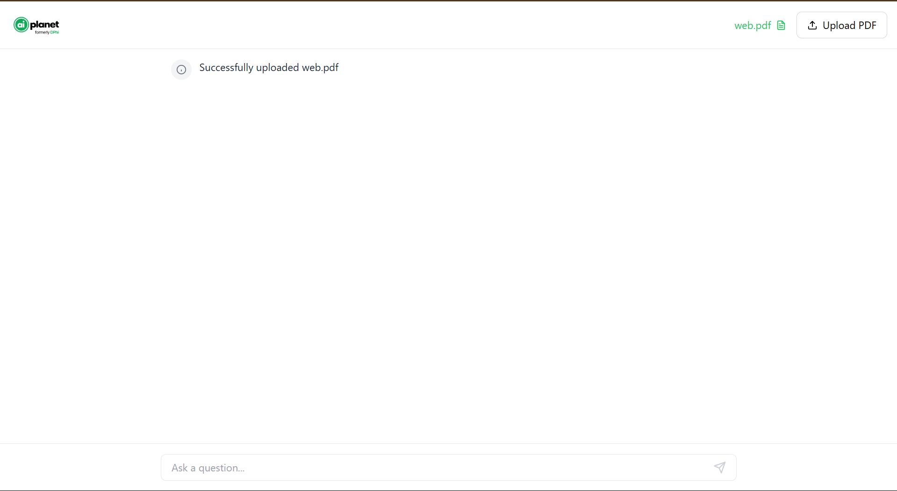

Here's a basic README for your PDF reader application project with FastAPI and React.js:

---

# PDF Reader Application

This application is a full-stack PDF reader built using FastAPI (backend) and React.js (frontend). It allows users to upload PDF documents, ask questions about the content of those documents, and receive intelligent answers generated through natural language processing (NLP) using LangChain and OpenAI.

## Table of Contents

- [Features](#features)
- [Tech Stack](#tech-stack)
- [Installation](#installation)
- [Backend Setup](#backend-setup)
- [Frontend Setup](#frontend-setup)
- [Usage](#usage)
- [Project Structure](#project-structure)
- [Acknowledgments](#acknowledgments)

## Features

- **PDF Upload**: Upload PDF files to the backend for text extraction and analysis.
- **Ask Questions**: Interact with the PDF content by asking questions and getting meaningful answers.
- **Dynamic Responses**: Responses are generated based on the content of the uploaded PDF using LangChain and OpenAI.

## Tech Stack

### Backend

- **FastAPI**: Web framework for the backend API.
- **SQLAlchemy**: ORM for database interaction.
- **LangChain**: Framework to manage language models and pipelines.
- **OpenAI**: Provides language models for NLP and question-answering.
- **PostgreSQL**: Database for storing document metadata and content.

### Frontend

- **React.js**: Frontend library for building interactive UIs.
- **Axios**: HTTP client for making API requests.
- **Tailwind CSS**: Utility-first CSS framework for styling.

## Installation

### Prerequisites

- Python 3.9 or higher
- Node.js and npm
- PostgreSQL

### Backend Setup

1. **Clone the repository**:
   ```bash
   git clone https://github.com/your-username/pdf-reader-app.git
   cd pdf-reader-app/backend
   ```

2. **Install dependencies**:
   ```bash
   pip install -r requirements.txt
   ```

3. **Set up the database**:
   - Create a PostgreSQL database (e.g., `pdf_reader_db`).
   - Configure the database connection in `app/database.py` or as environment variables.

4. **Set up OpenAI API key**:
   - Sign up for OpenAI, get your API key, and set it as an environment variable:
     ```bash
     export OPENAI_API_KEY="your_openai_api_key"
     ```

5. **Run the server**:
   ```bash
   uvicorn app.main:app --reload
   ```
   The backend will be available at `http://localhost:8000`.

### Frontend Setup

1. **Navigate to the frontend directory**:
   ```bash
   cd ../frontend
   ```

2. **Install dependencies**:
   ```bash
   npm install
   ```

3. **Start the frontend**:
   ```bash
   npm start
   ```
   The frontend will be available at `http://localhost:3000`.

## Usage

1. **Upload a PDF**:
   - Navigate to `http://localhost:3000` and upload a PDF document.
   - The backend will process and store the document's content.

2. **Ask Questions**:
   - Type questions related to the PDF's content in the input field, and receive responses based on the content of the uploaded PDF.

## Project Structure

```
pdf-reader-app/
├── backend/
│   ├── app/
│   │   ├── main.py            # FastAPI main app entry
│   │   ├── database.py        # Database configuration
│   │   ├── models.py          # Database models
│   │   ├── routers/
│   │   │   ├── question.py    # Question-asking endpoint
│   │   │   └── upload.py      # PDF upload endpoint
│   │   ├── utils/             # Utility functions
├── frontend/
│   ├── src/
│   │   ├── components/
│   │   │   ├── PDFUploadInterface.js  # Main UI component for interaction
│   │   ├── api.js             # Axios API calls to backend
│   ├── public/
│   ├── index.js               # Frontend entry point
├── README.md
├── requirements.txt           # Backend dependencies
└── package.json               # Frontend dependencies
```

## Acknowledgments

- **LangChain**: For enabling language processing pipelines.
- **OpenAI**: For providing the NLP model for question-answering.
- **FastAPI**: For a high-performance backend API.
- **React.js** and **Tailwind CSS**: For building a responsive and intuitive frontend UI.

---
### Request

I'm encountering an issue with the backend when asking questions, as it throws an error indicating that parameters are not formatted correctly. I would appreciate any tips or guidance on how to troubleshoot and resolve this problem effectively. Thank you for your assistance in advance.


